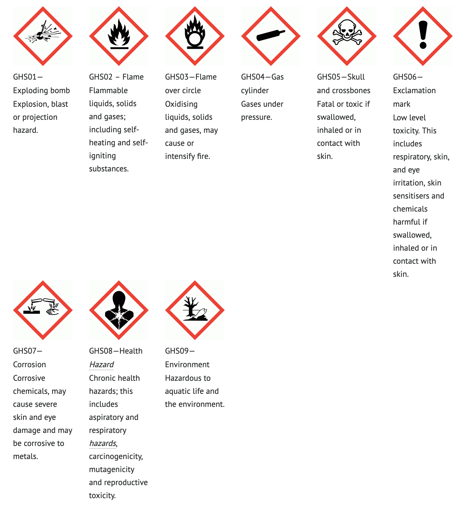

# Hazardous Chemicals, and Disposal

Hazardous chemicals in their many forms are well recognised as a threat to the environment. In response to this threat, The government at all levels have issued directives and guidelines for the storage and handling of these chemicals. 

For businesses, compliance with these directives and guidelines is a significant bureaucratic effort; business must track the storage and use of these chemicals as well as ensuring that staff are trained in the proper handling of them.   As a small voluntary organisation, HSBNE does not have the capacity to run such arrangements, even with the best of technology. Consequently, the organisation has decided that it has no other option than to place the onus for any compliance on the individual member.

### Definition of Hazardous Chemicals for this policy
     

A hazardous chemical is defined as a substance, mixture or article that satisfies the criteria for a hazard class in the GHS published by the United Nations. They may have health hazards, physical hazards or both.

A quick test to see if a chemical is considered hazardous, is to look for a GHS pictogram. The latest list is available on the United Nations website [here](http://www.unece.org/trans/danger/publi/ghs/pictograms.html), and a snapshot of current ones is below.

{: .image-full-width}

### Hazardous Chemical Policy

HSBNE requires that a member:

- be responsible for any hazardous chemicals they bring on site, 
- uses the chemicals in accordance with the instructions that come with it
- cleans up any spills using a safe and appropriate measure and ensures the local environment (including any storm water drains) are not contaminated
- removes those chemicals and any associated waste from the site on the same day.

As a consequence of this directive, a member must be aware of:
 
- the formal description of the chemical via, for example, the Material Safety Data Sheet (MSDS).
- the required PPE for the use of the chemical.
- the equipment required to clean up a spill.
- any possible injuries arising from exposure to the chemical and the appropriate First Aid response to that.

When using the chemical, the member must:

- observe all the manufacturer’s guidelines.
- use all appropriate PPE.
- take care to minimise the chance of a spill.
- ensure that any waste is captured in a suitable container.

Should there be a spill, the member must:

- clean up the spill in accordance with the manufacturer’s recommendations.
- ensure that no chemical flows or is hosed into the stormwater system.
- disposes of any waste generated by taking it to a BCC resource recovery centre or similar waste disposal facility.
- notify the HSBNE executive that a spill has occurred and has been cleaned up.

At the end of the job, the member must:

- gather up any remaining chemical for removal offsite that day to a location of the member’s choosing.
- collect any waste generated in a suitable container again for removal off-site but to a resource recovery centre with facilities to handle that chemical.

### Cause Maintained Chemicals
If a cause has decided they would like to keep a hazardous chemical onsite that would otherwise be prohibited by this policy, they may do so provided:

- it is stored safely and appropriately according to the manufacturer guidelines and industry best practices
- the storage of the hazardous chemical on site does not pose an unreasonable risk to the health and safety of members
- the cause maintains an official wiki page with a list of the chemicals they keep on site
- any relevant MSDS documents are stored in the cause's official MSDS binder
- any relevant usage instructions are stored in the cause's official equipment binder and documented on the wiki
- all appropriate PPE and cleanup materials are available nearby

This does not remove the liability that an individual member has when using that hazardous chemical to follow this policy. Members must still follow all other requirements of this policy including minimising the chance of spills, ensure waste is captured and disposed of, etc.
