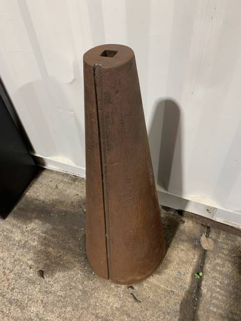

Blacksmithing at HSBNE is a thriving community initiative where enthusiasts and learners come together to explore the traditional art of blacksmithing. The group offers workshops, courses, and open forge sessions to help individuals develop their skills in metalworking. With a focus on safety and collaboration, members share resources, knowledge, and techniques in a well-equipped facility. This hands-on experience not only preserves the craft but also fosters a sense of camaraderie among blacksmithing enthusiasts in the greater Brisbane area.

At HSBNE (Hackerspace Brisbane), blacksmithing enthusiasts have access to a variety of tools and equipment to facilitate their metalworking projects. Some of the key blacksmithing tools available at HSBNE include:

{: height="300px"} 
Gas Forge: A furnace for heating metal to high temperatures, essential for shaping and molding the workpiece.

{:style="clear: left"}
{:style="clear: align-left"}

{: height="300px" .align-right} 

{:style="clear: left"}

{: .image-left}
  
{:style="clear: image-left"}
{: .image-left}

{:style="clear: image-left"}

Anvils: A heavy, flat-surfaced iron or steel block on which heated metal is placed and hammered into shape.

Hammers: Different types of hammers, such as cross-peen, ball-peen, square faced rounding, french peen, and sledgehammers, for shaping and manipulating metal.

Tongs: Plenty of tongs used to hold different shapes of material and manipulate hot metal during the forging process.

Swage Block: A large, heavy block containing various shapes and sizes of holes, used for shaping metal by hammering or pressing.

Chisels and Punches: Tools for cutting, shaping, and making holes in metal.

Blacksmtihing Vise: A large clamping device used to hold a workpiece securely while it's being worked on.

Files and Rasps: Abrasive tools for smoothing, shaping, and finishing metal surfaces.

Quench Buckets: Control the cooling rate of the heated metal, which in turn affects its final properties such as hardness, strength, and brittleness.

Annealing Buckets: Slow the cooling rate down, which will make the metal softer and more ductile.

Cone Mandrel: A cone (or mandrel) is for hammering barstock into perfect conical rings or scroll shapes.

Safety Gear: Essential safety equipment like gloves, aprons, safety glasses, and hearing protection to ensure the safety of blacksmiths during the forging process.

HSBNE provides these tools and more to support members in their blacksmithing endeavors, allowing them to learn and develop their skills in a well-equipped environment.
